# RAG Capstone Project Architecture

This document provides a comprehensive architectural overview of the RAG (Retrieval-Augmented Generation) pipeline for financial question answering using the FinQA dataset.

## System Architecture Diagram

```mermaid
graph TB
    subgraph "Data Layer"
        DS[RAGBench FinQA Dataset<br/>HuggingFace]
        DL[Data Loader<br/>data_loader.py]
        DS --> DL
    end

    subgraph "Document Processing"
        DC[Document Chunker<br/>chunker.py]
        SC[Sentence Chunking<br/>configurable overlap]
        SMC[Semantic Chunking<br/>similarity-based]
        DC --> SC
        DC --> SMC
    end

    subgraph "Embedding Models"
        EM[Multi-Embedding Retriever<br/>retriever.py]
        M1[MiniLM-L6<br/>384d baseline]
        M2[MPNet-base<br/>768d general]
        M3[BGE-base<br/>768d BAAI]
        M4[E5-base<br/>768d Microsoft]
        M5[FinBERT<br/>768d financial]
        EM --> M1
        EM --> M2
        EM --> M3
        EM --> M4
        EM --> M5
    end

    subgraph "Vector Store"
        VDB[(ChromaDB<br/>Persistent Storage)]
        COL1[Collection: minilm]
        COL2[Collection: mpnet]
        COL3[Collection: bge-base]
        COL4[Collection: e5-base]
        COL5[Collection: finbert]
        VDB --> COL1
        VDB --> COL2
        VDB --> COL3
        VDB --> COL4
        VDB --> COL5
    end

    subgraph "LLM Generation"
        GEN[RAG Generator<br/>generator.py]
        GROQ[Groq API]
        L1[Llama 3.1 8B<br/>fast]
        L2[Llama 3.3 70B<br/>best quality]
        L3[Llama 4 Scout/Maverick]
        L4[Qwen 3 32B]
        L5[GPT-OSS 120B]
        GEN --> GROQ
        GROQ --> L1
        GROQ --> L2
        GROQ --> L3
        GROQ --> L4
        GROQ --> L5
    end

    subgraph "Pipeline Orchestration"
        PIPE[Enhanced RAG Pipeline<br/>pipeline.py]
        P1[Phase 1:<br/>Embedding Comparison]
        P2[Phase 2:<br/>Chunking Comparison]
        P3[Phase 3:<br/>LLM Comparison]
        OPT[Optimal Config<br/>Selection]
        PIPE --> P1
        PIPE --> P2
        PIPE --> P3
        P1 --> P2
        P2 --> P3
        P3 --> OPT
    end

    subgraph "Evaluation & Benchmarking"
        BENCH[Benchmark Embeddings<br/>benchmark_embeddings.py]
        COMP[Model Comparison<br/>model_comparison.py]
        METRICS[Metrics:<br/>- Retrieval Score<br/>- Semantic Similarity<br/>- Generation Time<br/>- Token Usage]
    end

    subgraph "Testing"
        T1[test_pipeline.py]
        T2[test_chunker.py]
        T3[test_embedding_benchmark.py]
    end

    %% Data Flow
    DL --> DC
    DC --> EM
    EM --> VDB
    VDB --> EM
    EM --> GEN
    GEN --> PIPE
    
    PIPE --> BENCH
    PIPE --> COMP
    BENCH --> METRICS
    COMP --> METRICS
    
    %% Testing connections
    T1 -.-> PIPE
    T2 -.-> DC
    T3 -.-> BENCH

    %% Styling
    classDef dataClass fill:#e1f5ff,stroke:#01579b,stroke-width:2px
    classDef processClass fill:#f3e5f5,stroke:#4a148c,stroke-width:2px
    classDef modelClass fill:#fff3e0,stroke:#e65100,stroke-width:2px
    classDef storageClass fill:#e8f5e9,stroke:#1b5e20,stroke-width:2px
    classDef llmClass fill:#fce4ec,stroke:#880e4f,stroke-width:2px
    classDef pipeClass fill:#fff9c4,stroke:#f57f17,stroke-width:3px
    classDef testClass fill:#eceff1,stroke:#37474f,stroke-width:1px,stroke-dasharray: 5 5
    
    class DS,DL dataClass
    class DC,SC,SMC processClass
    class EM,M1,M2,M3,M4,M5 modelClass
    class VDB,COL1,COL2,COL3,COL4,COL5 storageClass
    class GEN,GROQ,L1,L2,L3,L4,L5 llmClass
    class PIPE,P1,P2,P3,OPT,BENCH,COMP,METRICS pipeClass
    class T1,T2,T3 testClass
```

## Component Overview

### 1. Data Layer
- **RAGBench FinQA Dataset**: Financial question-answering dataset from HuggingFace
- **Data Loader** (`src/data_loader.py`): Loads and explores the dataset

### 2. Document Processing
- **Document Chunker** (`src/chunker.py`): Implements two chunking strategies
  - **Sentence Chunking**: Fixed-size chunks with configurable overlap
  - **Semantic Chunking**: Dynamic chunks based on semantic similarity between sentences

### 3. Embedding Models
- **Multi-Embedding Retriever** (`src/retriever.py`): Supports 5 embedding models
  - **MiniLM-L6-v2**: 384-dimensional, lightweight baseline
  - **MPNet-base-v2**: 768-dimensional, best general-purpose
  - **BGE-base-en-v1.5**: 768-dimensional, high-performance from BAAI
  - **E5-base-v2**: 768-dimensional, Microsoft's retrieval-focused model
  - **FinBERT**: 768-dimensional, specialized for financial text

### 4. Vector Store
- **ChromaDB**: Persistent vector database
- Separate collections for each embedding model
- Cosine similarity for retrieval

### 5. LLM Generation
- **RAG Generator** (`src/generator.py`): Uses Groq API for fast inference
- **Available Models**:
  - Llama 3.1 8B (fast, good quality)
  - Llama 3.3 70B (best quality)
  - Llama 4 Scout/Maverick
  - Qwen 3 32B
  - GPT-OSS 120B

### 6. Pipeline Orchestration
- **Enhanced RAG Pipeline** (`src/pipeline.py`): Three-phase comparison system
  - **Phase 1**: Compare embedding models on retrieval quality
  - **Phase 2**: Compare chunking strategies
  - **Phase 3**: Compare LLM models on generation quality
  - **Output**: Optimal configuration selection

### 7. Evaluation & Benchmarking
- **Benchmark Embeddings** (`src/benchmark_embeddings.py`): Embedding model evaluation
- **Model Comparison** (`src/model_comparison.py`): Comprehensive model comparison
- **Metrics**:
  - Retrieval score (cosine similarity)
  - Semantic similarity (ground truth vs generated)
  - Generation time
  - Token usage

### 8. Testing
- `test_pipeline.py`: Pipeline integration tests
- `test_chunker.py`: Chunking strategy tests
- `test_embedding_benchmark.py`: Embedding benchmark tests

## Data Flow

1. **Load Data**: FinQA dataset → Data Loader
2. **Process Documents**: Documents → Chunker → Chunks
3. **Embed & Index**: Chunks → Embedding Model → Vector Store
4. **Retrieve**: Query → Embedding → Vector Search → Top-K chunks
5. **Generate**: Query + Retrieved Chunks → LLM → Response
6. **Evaluate**: Compare configurations across all dimensions

## Key Features

- **Multi-Model Support**: Test and compare multiple embedding and LLM models
- **Flexible Chunking**: Choose between sentence-based and semantic chunking
- **Persistent Storage**: ChromaDB for efficient vector storage and retrieval
- **Comprehensive Evaluation**: Automated comparison across all pipeline components
- **Apple Silicon Optimized**: MPS (Metal Performance Shaders) support for M-series chips

## Technology Stack

- **Embeddings**: sentence-transformers, HuggingFace models
- **Vector Store**: ChromaDB
- **LLM API**: Groq (Llama, Qwen, GPT-OSS models)
- **Dataset**: RAGBench FinQA
- **ML Framework**: PyTorch with MPS support
- **Evaluation**: scikit-learn, pandas, numpy

## Configuration Files

- `requirements.txt`: Python dependencies
- `.env`: API keys (GROQ_API_KEY)
- `chroma_db*/`: Persistent vector store directories
- `*_results.json`: Benchmark and comparison results
